# Current Architecture Overview

This diagram shows the complete flow of all components involved in note placement, measure calculations, note display/offset, and playback locations in the strumstick tab viewer.

## System Architecture

```mermaid
graph TB
    subgraph "User Input Layer"
        UI[TabViewer.tsx]
        KB[Keyboard Input]
        MOUSE[Mouse/Click Events]
        TOOLBAR[Professional Toolbar]
    end

    subgraph "State Management Layer"
        APP[App.tsx]
        TAB_DATA[tabData: TabData]
        CURSOR[currentPosition: CursorPosition]
        PLAYBACK[currentPlaybackTimeSlot]
        SELECTED[selectedNotes: Array]
        CUSTOM_LINES[customMeasureLines: Array]
    end

    subgraph "Note Placement System"
        ADD_NOTE[addNote function]
        REMOVE_NOTE[removeNote function]
        MOVE_CURSOR[moveCursor function]
        POSITION_CLICK[handlePositionClick]
        NOTE_INPUT[Number key input 0-9]
        FRET_INPUT[currentFretInput state]
    end

    subgraph "Measure Calculation Engine"
        IMP[IntelligentMeasurePlacement.ts]
        MPE[MeasurePlacementEngine]
        MCA[MusicalContextAnalyzer]
        NMS[NoteMovementSystem]
        VPM[VisualPlaybackMapper]
        
        subgraph "Boundary Calculation"
            CALC_BOUNDS[calculateMeasureBoundaries]
            GET_CUSTOM[getCustomMeasureBoundaries]
            GET_INTEL[getIntelligentMeasureBoundaries]
        end
    end

    subgraph "Visual Offset Management"
        VOM[VisualOffsetManager.ts]
        UPDATE_OFFSETS[updateOffsets method]
        GET_OFFSET[getOffset method]
        VISUAL_OFFSETS[visualOffsets: Map]
    end

    subgraph "Position Calculation Functions"
        TYPES[types.ts functions]
        GET_SLOT_X[getSlotX]
        GET_VISUAL_SLOT_X[getVisualSlotX]
        GET_VISUAL_NOTE_X[getVisualNoteX]
        GET_MEASURE_LINE_X[getMeasureLineX]
        GET_INTEL_OFFSET[getIntelligentVisualOffset]
    end

    subgraph "Display/Rendering Layer"
        SVG[SVG Rendering]
        NOTES_RENDER[Note Circles & Text]
        MEASURES_RENDER[Measure Lines]
        CURSOR_RENDER[Orange Cursor Circle]
        PLAYBACK_RENDER[Green Playback Line]
        TIES_RENDER[Tie Curves]
    end

    subgraph "Playback System"
        CONTROLS[Controls.tsx]
        TONE_JS[Tone.js Transport]
        METRONOME[Metronome Callback]
        PLAY_NOTE[playNote function]
        SYNC_ENGINE[SyncEngine]
        PLAYBACK_BAR[PlaybackBar.tsx]
    end

    %% User Input Flow
    UI --> APP
    KB --> UI
    MOUSE --> UI
    TOOLBAR --> APP

    %% State Flow
    APP --> TAB_DATA
    APP --> CURSOR
    APP --> PLAYBACK
    APP --> SELECTED
    APP --> CUSTOM_LINES

    %% Note Placement Flow
    UI --> ADD_NOTE
    UI --> REMOVE_NOTE
    UI --> MOVE_CURSOR
    UI --> POSITION_CLICK
    KB --> NOTE_INPUT
    NOTE_INPUT --> FRET_INPUT
    FRET_INPUT --> ADD_NOTE

    %% Measure Calculation Flow
    TAB_DATA --> IMP
    CUSTOM_LINES --> IMP
    IMP --> MPE
    IMP --> MCA
    IMP --> NMS
    IMP --> VPM
    IMP --> CALC_BOUNDS
    CALC_BOUNDS --> GET_CUSTOM
    CALC_BOUNDS --> GET_INTEL

    %% Visual Offset Flow
    IMP --> VOM
    TAB_DATA --> VOM
    CUSTOM_LINES --> VOM
    VOM --> UPDATE_OFFSETS
    VOM --> VISUAL_OFFSETS
    VISUAL_OFFSETS --> GET_OFFSET

    %% Position Calculation Flow
    CURSOR --> TYPES
    TAB_DATA --> TYPES
    CUSTOM_LINES --> TYPES
    VISUAL_OFFSETS --> TYPES
    TYPES --> GET_SLOT_X
    TYPES --> GET_VISUAL_SLOT_X
    TYPES --> GET_VISUAL_NOTE_X
    TYPES --> GET_MEASURE_LINE_X
    TYPES --> GET_INTEL_OFFSET

    %% Display Flow
    TYPES --> SVG
    TAB_DATA --> SVG
    CURSOR --> SVG
    PLAYBACK --> SVG
    SELECTED --> SVG
    SVG --> NOTES_RENDER
    SVG --> MEASURES_RENDER
    SVG --> CURSOR_RENDER
    SVG --> PLAYBACK_RENDER
    SVG --> TIES_RENDER

    %% Playback Flow
    APP --> CONTROLS
    CONTROLS --> TONE_JS
    TONE_JS --> METRONOME
    METRONOME --> PLAY_NOTE
    METRONOME --> PLAYBACK
    APP --> SYNC_ENGINE
    APP --> PLAYBACK_BAR

    %% Cross-connections showing the problem areas
    VOM -.->|ISSUE: Offset calculation| TYPES
    IMP -.->|ISSUE: Boundary placement| VOM
    TYPES -.->|ISSUE: Position inconsistency| SVG
```

## Key Components

### User Input Layer
- **TabViewer.tsx**: Main component handling mouse clicks, keyboard input, and SVG rendering
- **Professional Toolbar**: Note duration selection, tool mode switching
- **Keyboard/Mouse Events**: Direct user interactions for note placement and navigation

### State Management
- **App.tsx**: Central state management for all tab data and cursor position
- **tabData**: Core musical data structure storing notes, timing, and metadata
- **currentPosition**: Cursor location for editing and playback starting point
- **selectedNotes**: Multi-note selection for tie creation and batch operations

### Position Systems
- **Logical Positions**: Base slot-based coordinates used by playback and data storage
- **Visual Positions**: Display coordinates with intelligent spacing and measure offsets
- **Position Calculation**: Helper functions in types.ts for converting between systems

### Problems Identified
1. **Multiple Positioning Systems**: Logical vs Visual coordinates create inconsistencies
2. **Circular Dependencies**: Components have complex interdependencies
3. **State Synchronization**: Visual offsets and measure boundaries can get out of sync
4. **Playback-Visual Mismatch**: Playback uses logical positions while display uses visual positions 