# Measure Placement Issues

This diagram illustrates the specific problems with the current measure placement and visual offset system that's causing the test failures.

## Current Problematic Flow

```mermaid
graph TD
    subgraph "Current Problematic Flow"
        A[User adds 8th notes: 0,2,4,6,8,10,12,14]
        B[IntelligentMeasurePlacement.calculateMeasureBoundaries]
        C[MeasurePlacementEngine.calculatePlacement]
        D["Eighth note rule: measure line at slot 1<br/>(firstNoteSlot + 1)"]
        E["BUT: Applied to 8th measure boundary<br/>Results in line at slot 17"]
        F[VisualOffsetManager.updateOffsets]
        G["PROBLEM: visualAdjustment.fromSlot = 17<br/>Offset starts at slot 18 (fromSlot + 1)"]
        H["SHOULD BE: Offset starts at slot 16<br/>(9th note = first note of next measure)"]
        I[getVisualNoteX / getVisualSlotX]
        J["Result: 10th note shifted instead of 9th"]
        
        A --> B
        B --> C
        C --> D
        D --> E
        E --> F
        F --> G
        G --> I
        I --> J
        
        H -.->|Correct behavior| I
    end

    subgraph "Multiple Conflicting Systems"
        K[TabViewer.tsx]
        L[types.ts helper functions]
        M[VisualOffsetManager singleton]
        N[IntelligentMeasurePlacement]
        O[Direct SVG positioning]
        
        K --> L
        K --> M
        K --> N
        K --> O
        
        L -.->|Different logic| M
        M -.->|Different timing| N
        N -.->|Different calculations| O
    end

    subgraph "Data Flow Issues"
        P[tabData changes]
        Q[customMeasureLines changes]
        R[Multiple updateOffsets calls]
        S[Race conditions]
        T[Inconsistent state]
        
        P --> R
        Q --> R
        R --> S
        S --> T
    end
```



## Root Cause Analysis

### Issue 1: Incorrect Offset Start Position
**Current Behavior:**
- Eighth notes placed at: slots 0, 2, 4, 6, 8, 10, 12, 14 (first 8 notes)
- Measure line calculated at: slot 17 (after last note of first measure)
- Visual offset applied from: slot 18 (fromSlot + 1)
- **Result**: 10th note gets shifted instead of 9th note

**Expected Behavior:**
- Visual offset should start at: slot 16 (first note of next measure)
- **Result**: 9th note gets shifted, creating proper measure boundary spacing

### Issue 2: Multiple Positioning Systems
The system has several competing approaches to positioning:

1. **Base Positioning** (`getSlotX`): Logical slot-based positioning
2. **Visual Positioning** (`getVisualNoteX`): Includes intelligent spacing offsets
3. **Measure Line Positioning** (`getMeasureLineX`): Custom positioning for measure lines
4. **Direct SVG**: Sometimes bypasses helper functions entirely

### Issue 3: State Management Problems
- **Singleton Pattern**: `VisualOffsetManager` uses singleton, making testing difficult
- **Update Timing**: Multiple components trigger `updateOffsets()` at different times
- **Circular Dependencies**: Components reference each other in complex ways

## Code Location Details

### VisualOffsetManager.ts (Line 52-76)
```typescript
// PROBLEM: This logic starts offset at wrong position
let offsetStartSlot = adjustment.fromSlot + 1; // Default behavior

if (eighthNoteCount >= 6) {
  offsetStartSlot = 16; // Override for eighth notes
}
```

### IntelligentMeasurePlacement.ts (Line 136-140)
```typescript
case 'eighth':
  // [E-|-*] -> Line 1 slot after start of eighth note, with visual adjustment
  measureLineSlot = context.firstNoteSlot + 1;
  visualAdjustment = 1; // Add visual slot for spacing
  break;
```

### Test Expectation (measure-placement.spec.ts)
```typescript
// Test expects 9th note (slot 16) to have 1-slot visual offset
const firstNoteOfNextMeasure = visualPositions.find(p => p.type === 'note' && p.slot === 16);
expect(Math.abs(actualOffset - desiredOffset)).toBeLessThanOrEqual(tolerance);
```

## Architecture Problems

### 1. Context Confusion
The `MeasurePlacementEngine` applies rules designed for individual note pairs to entire measure calculations, causing incorrect boundary placement.

### 2. Offset Application Logic
The `VisualOffsetManager` applies a generic `fromSlot + 1` rule that doesn't account for the specific musical context of measure boundaries.

### 3. Testing Difficulties
- Singleton pattern makes unit testing difficult
- Integration between multiple systems creates complex dependencies
- State mutations happen in multiple places, making debugging challenging

## Suggested Architectural Changes

1. **Unified Coordinate System**: Single source of truth for all positioning
2. **Context-Aware Offset Calculation**: Offset logic that understands musical boundaries
3. **Dependency Injection**: Replace singleton with dependency injection for testability
4. **Clear Separation**: Distinct responsibilities for logical vs visual positioning 