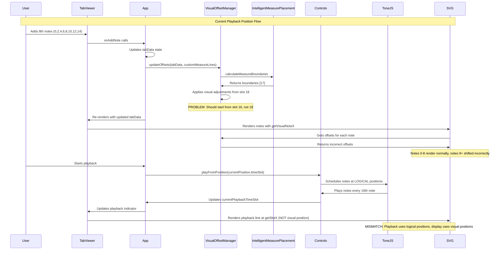
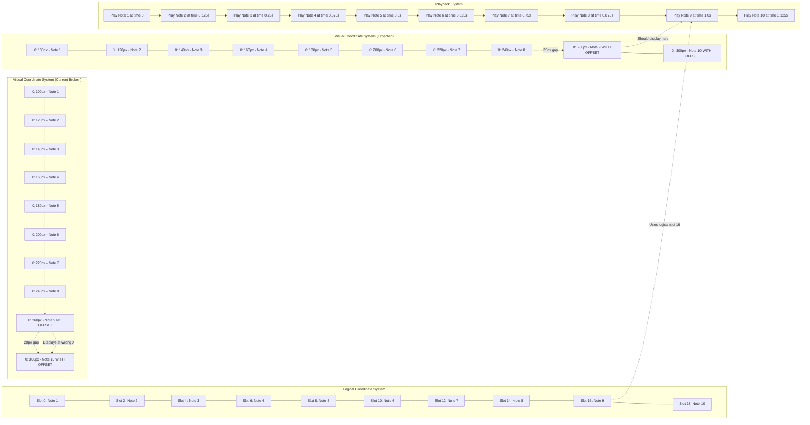
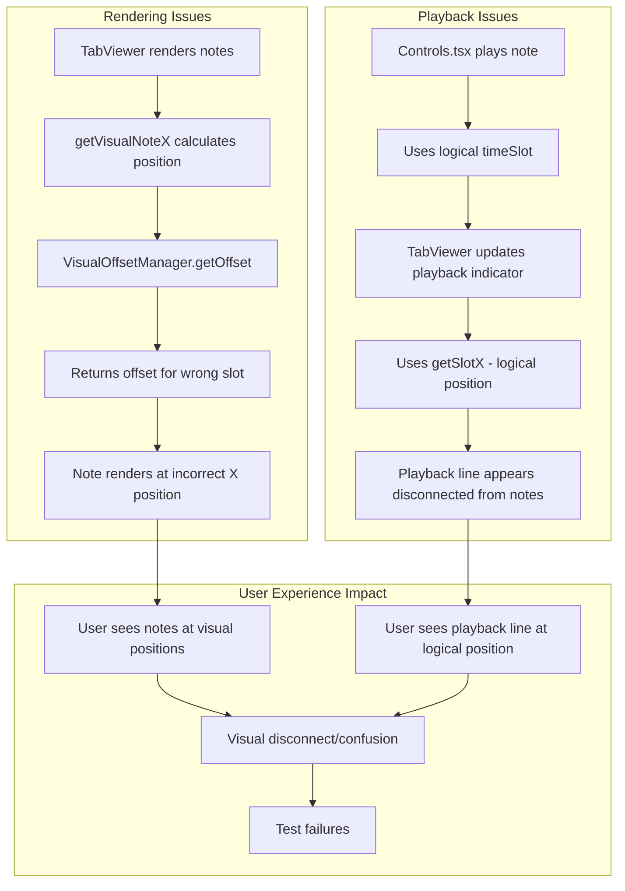

# Playback and Visual Flow Analysis

This sequence diagram shows how the current systems interact with playback and highlights the mismatches between logical and visual positioning.

## Playback-Visual Interaction Sequence

## Coordinate System Conflicts

## Component Interaction Problems

## State Management Timeline

```mermaid
gantt
    title State Update Timeline (Current Issues)
    dateFormat X
    axisFormat %s
    
    section User Action
    User types "0 Tab" for 8th note : milestone, m1, 0, 0
    
    section Immediate Updates
    TabViewer onAddNote      : active, t1, 0, 50
    App addNote function     : active, t2, 25, 75
    tabData state update     : active, t3, 50, 100
    
    section Measure Calculation
    getCustomMeasureBoundaries : active, t4, 75, 150
    IntelligentMeasurePlacement : active, t5, 100, 175
    calculateMeasureBoundaries : active, t6, 125, 200
    
    section Visual Offsets (PROBLEMATIC)
    VisualOffsetManager.updateOffsets : crit, t7, 150, 225
    Calculate boundaries [17]         : crit, t8, 175, 250
    Apply offsets from slot 18        : crit, t9, 200, 275
    
    section Rendering
    TabViewer re-render    : active, t10, 225, 300
    getVisualNoteX calls   : active, t11, 250, 325
    SVG position updates   : active, t12, 275, 350
    
    section Problems
    Wrong notes shifted    : crit, t13, 300, 350
    Visual-playback mismatch : crit, t14, 325, 350
```

## Key Issues Identified

### 1. **Timing Misalignment**
- Visual offsets are calculated after measure boundaries
- But visual offsets affect where measure boundaries should be placed
- Creates circular dependency and incorrect results

### 2. **Coordinate System Split**
- **Logical System**: Used by playback, data storage, and some rendering
- **Visual System**: Used by note positioning and user interface
- **No Translation Layer**: Systems don't properly communicate

### 3. **State Synchronization**
- Multiple components trigger visual offset updates
- Race conditions between updates
- Inconsistent state between components

### 4. **Testing Challenges**
- Integration tests fail due to coordinate system mismatches
- Unit tests difficult due to singleton patterns
- Complex dependencies make mocking challenging 